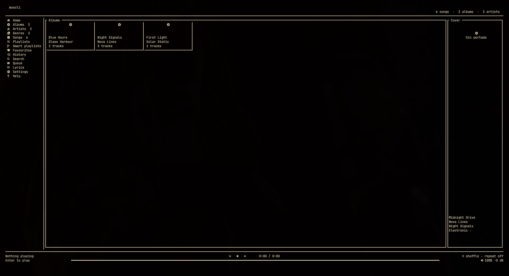

# muscli

> [Documentación en español](docs/README.es.md)

muscli is a fast, local-first music player with a Spotify-like terminal UI. It
indexes removable drives and local folders, keeps playlists usable while a
drive is offline, and plays FLAC, MP3, M4A/AAC/ALAC, Ogg, Opus, WAV, AIFF,
WavPack and Monkey's Audio gaplessly — through its own audio path, which
decodes and mixes in floating point and can run bit-perfect, or through mpv.
It has no account, streaming service, telemetry, or resident daemon.



## Platforms

- Linux: MPRIS, removable media discovery, Discord Rich Presence, and an
  optional Omarchy integration.
- Windows 11 x64: the same TUI, removable-drive discovery, Windows media
  controls (SMTC), media keys, and Discord Rich Presence.

The Windows installer bundles verified mpv and FFmpeg executables. See
[third-party notices](THIRD_PARTY_NOTICES.md) for exact builds, checksums,
licenses, and corresponding source. Early installers are unsigned, so Windows
SmartScreen may ask for confirmation.

## Install

### Linux

Install the runtime dependencies first. muscli needs ALSA (`libasound.so.2`),
mpv, and FFmpeg. On Arch-based systems:

```bash
sudo pacman -S alsa-lib mpv ffmpeg
```

On Debian:

```bash
sudo apt install libasound2 mpv ffmpeg
```

On Ubuntu 24.04 or newer:

```bash
sudo apt install libasound2t64 mpv ffmpeg
```

Download the Linux archive from the
[v0.2.0-beta.2 release](https://github.com/Kumpelo/muscli/releases/tag/v0.2.0-beta.2),
then install the binary for your user:

```bash
tar -xzf muscli-v0.2.0-beta.2-linux-x86_64.tar.gz
install -Dm755 muscli-v0.2.0-beta.2-linux-x86_64/muscli "$HOME/.local/bin/muscli"
muscli --version
```

Make sure `$HOME/.local/bin` is in `PATH`.

### Omarchy

```bash
omarchy pkg add alsa-lib mpv ffmpeg
muscli setup omarchy
```

Omarchy setup only edits user-owned configuration, creates timestamped
backups, validates Hyprland, enables the official media widget, and installs:

- `SUPER+SHIFT+ALT+M`: open the large floating muscli window.
- `Shift+Volume Up/Down`: change only muscli's volume.

Undo intact managed blocks with `muscli setup omarchy --undo`.

### Build from source

Install the ALSA development headers and Rust 1.90 or newer, clone the
repository, then run:

```bash
cargo install --locked --root "$HOME/.local" --path .
```

### Windows 11

Download `muscli-vX.Y.Z-windows-x86_64-setup.exe` from Releases and run it.
The Start menu contains muscli and `muscli Doctor`; the installer also
registers `muscli.exe` in Windows App Paths. Windows Terminal is recommended
for the best image support.

## Quick start

```bash
muscli library add /path/to/Music
muscli library rescan
muscli doctor
muscli
```

Inside the app, use the arrow keys or `hjkl` to move, Enter to open or play,
Space to pause, `/` to search, `,` for settings, `?` for help, and `q` to save
and quit.

## Library and playback

```text
muscli library add PATH
muscli library remove PATH
muscli library list
muscli library rescan
muscli library prune
muscli library forget-positions
muscli library analyze-gain
muscli library write-gain --yes
muscli doctor
muscli playlist export NAME playlist.m3u8
muscli playlist import playlist.m3u8
muscli summary --days 30
muscli devices
```

`muscli summary` reports what you have been listening to from the local index.
Like everything else here, it sends nothing anywhere.

## Audio backends

Playback goes through mpv by default. Setting `audio_backend = "native"` in
`config.toml` uses the built-in path instead: the file is decoded to floating
point here, processed here, and written straight to the device, with
`muscli devices` listing what is available and `audio_device` choosing one.

The native path opens the device at the file's own sample rate whenever the
device will take it, so nothing is converted that did not need converting.
When it will not, the conversion is done here with a 256-tap sinc filter
rather than left to a sound server: measured against a tone, 15 kHz survives
44.1 to 48 kHz within 0.1 dB and the conversion's own images stay below
-80 dB.

What it does, in order, is ReplayGain, then the equaliser, then a look-ahead
limiter that keeps an equaliser boost from clipping. The volume is applied at
the device, so a change is heard on the next callback instead of behind the
half second already buffered, and on an integer device the samples are
dithered after it. With all of them neutral the samples that reach the device
are the samples that were in the file, bit for bit; with all of them working
the arithmetic adds distortion at -144.8 dB, which is below what a 24-bit
recording can hold, and costs 2.6 ms of one core per second of stereo.

`bit_perfect = true` hands the decoder's output over untouched, which means
giving up the volume control, ReplayGain and the equaliser to do it; the
settings view says so rather than leaving those controls looking as though
they still work. What it promises is that muscli changes nothing. Whether the
samples reach the converter unchanged is then up to the device: an exclusive
or hardware device gets them as they are, while a shared one on PulseAudio,
PipeWire or WASAPI Shared may still be mixed and resampled after muscli is
done with them.

Album sides that were mastered to run together do: the next track is opened
early and joined to the one playing inside the same device stream, so the
samples of the second follow the samples of the first with nothing between
them. A track at a different sample rate cannot be joined that way and gets
its own stream, which is a gap — there is no way around that.

Seeking keeps the device open. The half second of audio already buffered is
discarded by the output on its way through rather than by rebuilding the
stream around it, so a seek costs the one buffer the device was filling
instead of asking the driver for the card again.

The native decoder does not read Opus, WavPack or Monkey's Audio, so files it
cannot read are handed to mpv automatically, chosen by opening the file
rather than by trusting its extension. mpv is started only if some file needs
it.

An eight-band equaliser is configured with `equalizer` in `config.toml`, as
gains in decibels from low to high — the bands are 60, 150, 400, 1000, 2400,
6000, 12000 and 16000 Hz, each an octave wide:

```toml
equalizer = [4.0, 2.0, 0.0, 0.0, 0.0, 0.0, 2.0, 3.0]
```

There is no default: an unset or all-zero list means the filter is not
installed at all, so nothing is coloured and nothing is heard. It works on
both backends and is designed to sound the same on each.

The volume control moves in decibels, not in amplitude, so every step is the
same size to the ear: with the default 5% step, each press is 3 dB wherever
you are in the range. `volume_range_db` sets how far down the bottom of the
travel reaches, -60 dB by default; zero is true silence rather than merely
very quiet. The status bar shows both the position and the decibels.

FLAC, MP3, M4A/AAC/ALAC, Ogg, Opus, WAV, AIFF, WavPack and Monkey's Audio are
indexed; narrow the list with `audio_extensions` in `config.toml`. Tags and
embedded or external artwork are read without modifying the media. The SQLite index, configuration, and 64 MiB size-bounded
cover cache use the platform-standard application directories. A warm start
loads the index immediately while scans and ReplayGain analysis continue in
the background.

Features include genres, artist releases, resume/history, editable smart
playlists, fuzzy search, a context menu, saved/reorderable queues, local
ReplayGain analysis, settings, a keybinding reference, and compact mode.

## Beta limitations

- The Windows installer is not signed, so SmartScreen may require manual
  confirmation.
- The native decoder falls back to mpv for Opus, WavPack, and Monkey's Audio.
- Gapless native playback requires adjacent tracks to use the same stream
  format; a sample-rate change opens a new stream.
- Changing or disconnecting an audio device may require restarting playback.

When reporting a problem, include the platform, exact muscli version,
reproduction steps, and the output of `muscli doctor`.

## Discord Rich Presence

```text
muscli setup discord --large-image peter
```

muscli ships with its official Discord application ID, so users do not need to
create or configure a Discord application. No bot token or OAuth is needed. The
local Discord/Vesktop IPC displays title, artist, album and progress. Assets named `peter_metal`, `peter_dj`, and
`daft_punk` are selected for their matching genres/artist; otherwise the
configured fallback is used. Local cover art is never uploaded.

## Main controls

| Key | Action |
|---|---|
| Arrows or `hjkl` | Navigate lists and album grids |
| Enter / Esc | Open or play / go back |
| Space, `n`, `p` | Pause, next, previous |
| `/`, `x`, `f`, `a` | Search, context menu, favorite, enqueue |
| `s`, `r`, `+`, `-` | Shuffle, repeat, volume |
| `m`, `,`, `?` | Compact mode, settings, help |
| `Shift+J/K`, `d` | Reorder or remove queue item |
| `C`, `S`, `L` | Clear, save, or load a queue |
| `q` | Save state and quit |

Run `muscli remote volume up|down|set PERCENT` or
`muscli remote mute-toggle` from another process. If muscli is closed these
commands exit silently and never change the system volume.

## Development

Building on Linux needs the ALSA headers, which is what the native audio
backend links against:

```bash
omarchy pkg add alsa-lib      # Debian and Ubuntu: apt install libasound2-dev
```

```bash
cargo fmt --all --check
cargo clippy --all-targets -- -D warnings
cargo test --all-targets
cargo build --release
```

CI runs these checks on Linux and Windows. The release workflow can build a
manual release candidate; tags matching `v*` create draft prereleases with
Linux and Windows artifacts, SHA-256 checksums, and a CycloneDX SBOM.

`muscli library write-gain` is the only command that modifies your audio files.
It writes the cached loudness analysis into their ReplayGain tags so other
players can use it, and requires `--yes`. Everything else muscli does reads
your files and never writes to them.

## Lyrics

Lyrics are never picked up automatically. An `.lrc` file sitting next to a
track is left alone; lyrics live in their own directory and only get there when
you put them there:

```bash
muscli lyrics import song.lrc --artist ARTIST --title TITLE
muscli lyrics import song.lrc --track TRACK_ID
muscli lyrics where
```

Naming by artist and title survives the audio file being moved; naming by track
id does not, because the id is derived from the path. Timed lines follow
playback; a file without timestamps is shown as plain text.

## Key bindings

`muscli keys` lists the bindings in effect. To change them, write
`keybindings.toml` in the configuration directory, naming actions as that
command prints them:

```toml
quit = ["ctrl+q"]
play_pause = ["space", "p"]
```

Listing an action replaces its default keys rather than adding to them. An
entry muscli cannot read is reported and skipped; it never stops muscli
starting.

## Themes

The interface ships with a light palette, and that is the default on Linux and
on Windows alike. Change it from the settings view (`,`), with the left and
right arrows on the **Theme** row, or set `theme` in `config.toml`:

| `theme` | |
|---|---|
| `light` | white background, the default |
| `dark` | the terminal's own palette |
| `high-contrast` | black on white, for bright rooms and projectors |
| `nord`, `gruvbox`, `solarized-light` | fixed palettes, identical everywhere |
| `system` | follow the desktop: the current Omarchy theme on Linux, light elsewhere |

With `system` on Linux the palette follows Omarchy live: switching theme there
repaints muscli without restarting it. `muscli --theme dark` tries a palette
for one run without changing the configured one.

## Language

The interface follows the system locale when it recognises it, and is English
otherwise. Change it from the settings view, set `language = "en"` or
`language = "es"` in `config.toml`, or pass `muscli --lang es` for one run.
Changing it in the settings view takes effect immediately, without restarting.

## Settings

Press `,` for the settings view. Left and right adjust a value, Space and Enter
toggle one or run the row. It covers the theme and language, compact mode,
covers, volume step, gapless playback, ReplayGain and its mode and target,
every equaliser band, resume and history, removable-drive detection, scan
threads, the cover-cache budget and Discord Rich Presence, and it can start a
rescan or a ReplayGain analysis. Every change is written to `config.toml` as
it is made; that file remains editable by hand.

muscli is MIT licensed. Contributions are welcome; see
[CONTRIBUTING.md](CONTRIBUTING.md) and [SECURITY.md](SECURITY.md).
